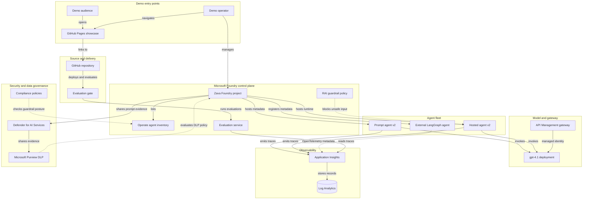
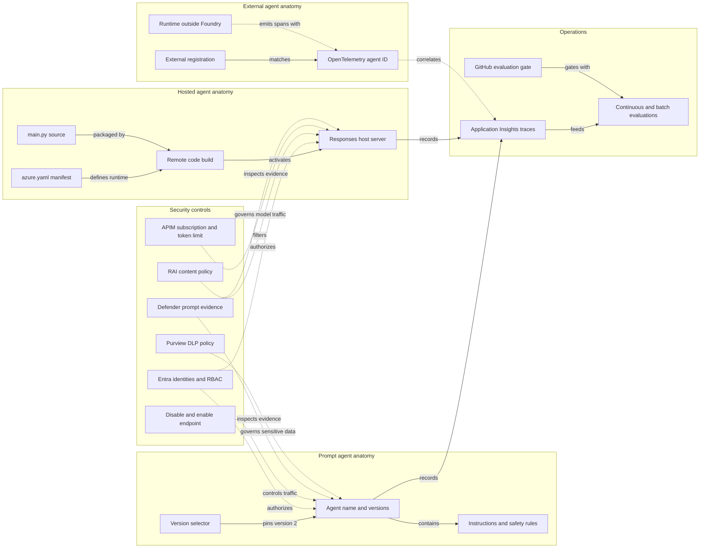

# Architecture Diagram

This document shows the deployed Zava Microsoft Foundry control plane and the configuration boundaries for each agent type. It separates platform-managed runtime behavior from source-controlled definitions and external runtime metadata.

## Application Architecture

<!-- mermaid-checked: no \n, no em-dash/en-dash, no {} in labels, subgraphs are id["label"], arrows are -->|"label"|, all subgraphs closed by end, ids unique -->

### Technology Stack Summary

| Layer | Technology | Version | Purpose |
|---|---|---:|---|
| Showcase | HTML, CSS, JavaScript | Browser-native | Public anatomy, security, and demo walkthrough |
| Control plane | Microsoft Foundry Agent Service | Current service API | Agent inventory, immutable versions, endpoints, identities, evaluations |
| Prompt agent | Foundry prompt agent | Version 2 | Model plus instructions managed by Foundry |
| Hosted agent | Agent Framework and ResponsesHostServer | Python 3.13 runtime | Custom code hosted and built by Foundry |
| External agent | LangGraph registration metadata | Version 1 | External runtime represented through an OpenTelemetry agent ID |
| Gateway | Azure API Management Developer | Current Azure API | Managed-identity backend, subscription key, 100 TPM policy |
| Model | Azure AI Services OpenAI | gpt-4.1 2025-04-14 | Shared model deployment |
| Observability | Application Insights and Log Analytics | Workspace-based | Requests, dependencies, events, traces, exceptions |
| Threat protection | Defender for AI Services | Standard plan | Model scanning, prompt evidence, and Purview evidence sharing |
| Data security | Microsoft Purview | Pay-as-you-go connected | DLP policy evaluation for Foundry interactions |
| Delivery | GitHub Actions | Workflow actions | Evaluation gate using project-scoped Azure credentials |

### Data Storage & External Services

The active Foundry project uses Basic Agent Setup, so agent state is stored in Microsoft-managed multitenant resources rather than customer-managed Cosmos DB, Storage, or AI Search. Application telemetry is written to workspace-based Application Insights and Log Analytics. API Management forwards model requests by managed identity and records gateway, LLM, and metric diagnostics in the same Log Analytics workspace. Defender for AI captures prompt evidence and shares enabled evidence with Microsoft Purview. Purview is connected to the subscription through a metered account so Foundry-scoped DLP policy evaluation can be configured.

### Key Architectural Decisions

- Basic Agent Setup avoids weakening the tenant policy that disables public Cosmos DB access.
- Prompt, hosted, and external agents intentionally demonstrate three different ownership and runtime boundaries.
- Source-controlled hosted-agent code is authoritative because the portal shows deployed runtime metadata, not the complete application source.

## Component Relationships

<!-- mermaid-checked: no \n, no em-dash/en-dash, no {} in labels, subgraphs are id["label"], arrows are -->|"label"|, all subgraphs closed by end, ids unique -->

### Component Inventory

| Component | Layer | Type | Responsibility |
|---|---|---|---|
| Agent name and versions | Prompt | Foundry resource | Holds immutable prompt-agent versions and endpoint metadata |
| Instructions and safety rules | Prompt | Configuration | Defines behavior, privacy rules, and response constraints |
| Version selector | Prompt | Endpoint rule | Sends all prompt-agent traffic to version 2 |
| `azure.yaml` manifest | Hosted | Source configuration | Defines runtime, resources, protocol, environment, and RAI policy |
| `main.py` source | Hosted | Python code | Constructs the Agent Framework agent and Responses host |
| Remote code build | Hosted | Foundry build | Resolves dependencies and creates the hosted runtime |
| Responses host server | Hosted | Runtime | Exposes the OpenAI Responses-compatible endpoint |
| External registration | External | Foundry metadata | Registers the external agent without moving its runtime |
| OpenTelemetry agent ID | External | Correlation key | Joins external spans to the Foundry inventory item |
| Entra identities and RBAC | Security | Identity control | Separates project, agent, gateway, user, and CI permissions |
| RAI content policy | Security | Runtime policy | Blocks jailbreak, harmful, protected, Purview, and Defender signals |
| APIM subscription and token limit | Security | Gateway policy | Authenticates callers and enforces a 100 TPM budget |
| Disable and enable endpoint | Security | Lifecycle control | Takes the prompt-agent endpoint offline without deleting versions |
| Defender prompt evidence | Security | Threat protection | Collects AI prompt evidence, scans models, and shares enabled evidence with Purview |
| Purview DLP policy | Security | Data governance | Evaluates sensitive information conditions for the Microsoft Foundry location |
| Application Insights traces | Operations | Telemetry | Stores requests, dependencies, events, traces, and exceptions |
| Evaluations | Operations | Quality control | Scores continuous prompt traffic and hosted-agent datasets |
| GitHub evaluation gate | Delivery | CI workflow | Authenticates to Azure and compares prompt-agent versions |
